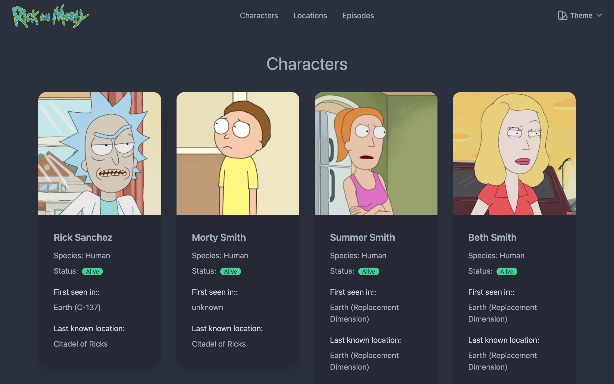
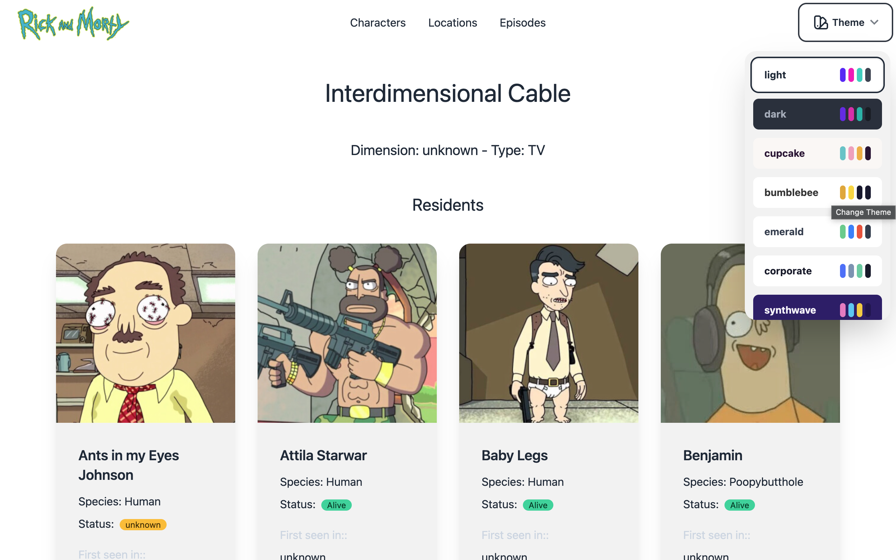
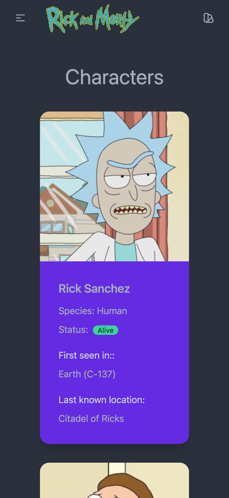

# Rick and Morty

This is an Angular project that consumes the Rick And Morty API






## Running

### Docker

Build:

```zsh
DOCKER_BUILDKIT=1 docker build --pull -f "Dockerfile" -t rickandmorty:latest "."
```

Serving the app on port **8080**:

```zsh
docker run -p 8080:80 rickandmorty
```

### Traditional

**Requisites**: Node, Angular and a package manager ([npm][npm-link], [yarn][yarn-link], [pnpm][pnpm-link] or [bun][bun-link]).

Serving the app on port **4200**:

```shell
npm install && ng serve
```
